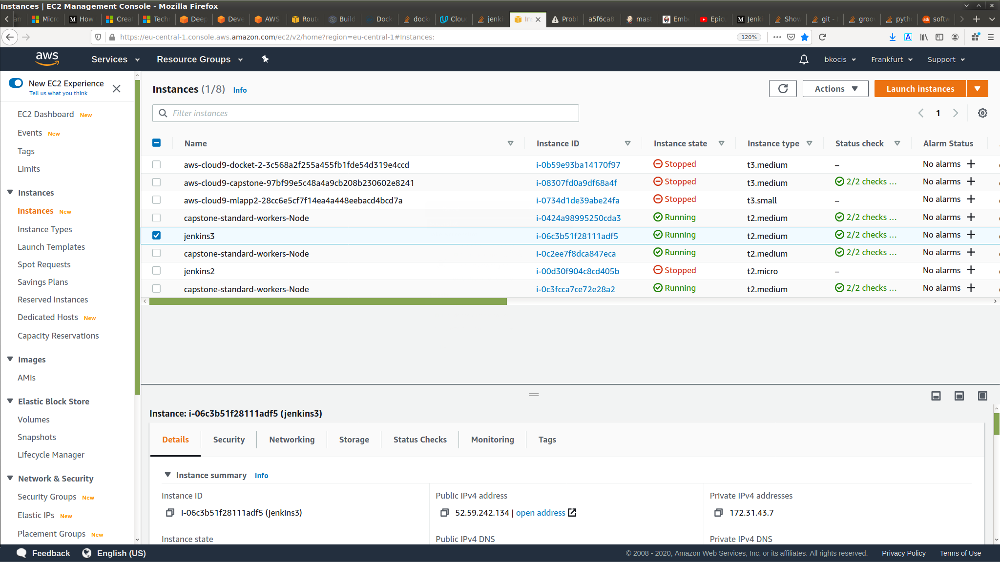

# Kubernetes-Docker-Jenkins-AWS deployment

## Description 

This repo contain the capstone project of the Udacity Cloud DevOps Engineer Nanodegree. The goal of the exercise is to deploy a containerized web application using kubernetes in AWS. 

The continuous integration and deplyment are tracked by a Jenkins pipeline. 

## Files 

    - Jenkinsfile
    - Dockerfile
    - web app

Jenkinsfile modification
added linting for python pylint, 
- installed it on the jenkins instance pip3 install pylint (no virtual env.), 
- installed "violations" jenkins plugin for pylint, 
- added a stage with syntax:
    `pylint --rcfile=pylint.cfg $(find . -maxdepth 1 -name "*.py" -print) MYMODULE/ > pylint.log || exit 0`

## Setting up
Running as cloud-native development from AWS Cloud9.

### Environment 

    - IAM role 

    - Code9 session/env
        - venv
        - installation 

    - Jenskins-on-the-server setup
        -
        -

